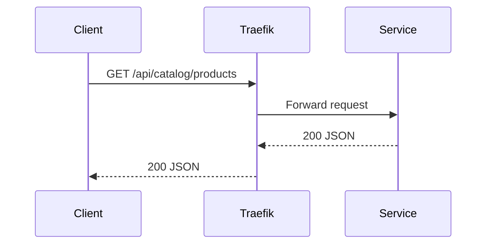

# API Gateway

StreamShop uses **Traefik v3** as the edge API gateway, the HTTP entrypoint for path-based routing.

## What's running today

- Image: `traefik:v3.6`
- HTTP entrypoint `web`: host `localhost:8080` → container `:80`
- Dashboard: `localhost:8081` (`--api.insecure`; not behind a Compose profile)
- Routed: `PathPrefix(/api/orders)` → order-api, `PathPrefix(/api/catalog)` → nginx (then 2× catalog-api), `PathPrefix(/api/analytics)` → analytics-api, `PathPrefix(/docs)` → docs-site
- Direct access: catalog replicas on `:3001` / `:3011`, order-api on `:3002`, analytics-api on `:3003`, event-processor on `:3004` (not behind Traefik)
- Not configured: TLS (`:8443`), rate limiting, request size limits, `X-Request-Id`

```yaml
labels:
  - traefik.enable=true
  - traefik.http.routers.order-api.rule=PathPrefix(`/api/orders`)
  - traefik.http.routers.order-api.entrypoints=web
  - traefik.http.services.order-api.loadbalancer.server.port=3002
```

## Responsibilities

| Concern | Today |
|---------|-------|
| Routing | Path-based: `/api/catalog/*`, `/api/orders/*`, `/api/analytics/*`, `/docs/*` |
| TLS | Not configured |
| Middleware | None (no rate limiting or request size limits) |
| Dashboard | Traefik UI on `:8081` |

## Why Traefik

Traefik integrates natively with Docker Compose via container labels. Adding a new service route is a matter of labels — no separate config reload step.

**Alternative considered:** Kong offers a richer plugin ecosystem but is heavier to configure locally. Traefik strikes the right balance for a portfolio demo.

## Routing table

| Path prefix | Upstream | Status |
|-------------|----------------|--------|
| `/api/orders/*` | order-api | **Built** |
| `/api/catalog/*` | nginx → catalog-api-1/2 | **Built** |
| `/api/analytics/*` | analytics-api | **Built** |
| `/docs/*` | docs-site (static build) | **Built** |

## Request flow


