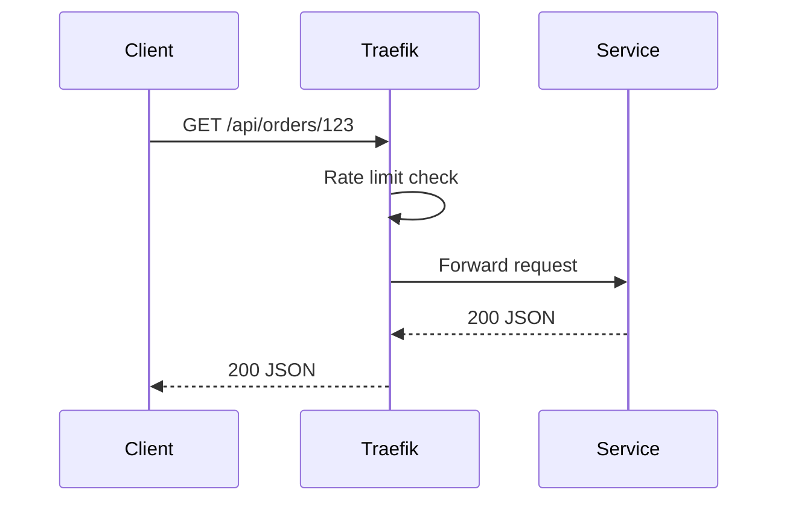

# API Gateway

StreamShop uses **Traefik v3** as the edge API gateway — the single entrypoint for all HTTP traffic.

## Responsibilities

| Concern | Implementation |
|---------|----------------|
| Routing | Path-based: `/api/catalog/*`, `/api/orders/*`, `/api/analytics/*` |
| TLS | Optional termination on `:8443` |
| Middleware | Rate limiting, request size limits |
| Dashboard | Traefik UI on `:8081` (dev profile) |

## Why Traefik

Traefik integrates natively with Docker Compose via container labels. Adding a new service route is a matter of labels — no separate config reload step.

**Alternative considered:** Kong offers a richer plugin ecosystem but is heavier to configure locally. Traefik strikes the right balance for a portfolio demo.

## Routing table

| Path prefix | Upstream |
|-------------|----------|
| `/api/catalog/*` | nginx → catalog-api (2 replicas) |
| `/api/orders/*` | order-api |
| `/api/analytics/*` | analytics-api |
| `/docs/*` | docs-site (static build) |

## Example label (Compose)

```yaml
labels:
  - "traefik.enable=true"
  - "traefik.http.routers.catalog.rule=PathPrefix(`/api/catalog`)"
  - "traefik.http.services.catalog.loadbalancer.server.port=3001"
```

## Request flow



All services receive a `X-Request-Id` header for correlation across logs and traces.
