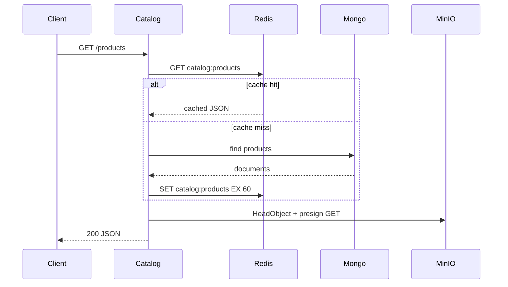

# Caching

StreamShop uses **Redis 8** as an in-memory cache. Redis is never used as a primary datastore. This keeps the durable vs ephemeral storage story clear.

## What's running today

Redis is in Docker Compose (`localhost:6379`, no password). **catalog-api** uses it for cache-aside (two replicas share the same keys). **order-api** uses it for optional `Idempotency-Key` on `POST /api/orders`. Redis is not a primary datastore.

catalog-api: Redis first, Mongo on miss, then `SET` with TTL **60 seconds**. Redis stores Mongo fields only; presigned `image_url` values are attached after the cache. Redis down does not fail catalog reads (`x-cache: miss`). `/ready` pings Mongo only.

order-api: Redis down (or `REDIS_URL` unset) **fail-closes** requests that send `Idempotency-Key` (`503`). Requests without the header still create orders.

Redis Insight is a local debug GUI on [http://localhost:5540](http://localhost:5540) (not behind Traefik). It is preconnected to the Compose Redis service as `streamshop`.

```bash
curl -sI http://localhost:8080/api/catalog/products | grep -i x-cache
docker compose exec redis redis-cli GET catalog:products
docker compose exec redis redis-cli GET 'idempotency:demo-001'
```

## Patterns

### Cache-aside (catalog-api)

Product list and detail endpoints use cache-aside:

1. Read from Redis
2. On miss, read from MongoDB
3. Write result to Redis with TTL (60 seconds)



### Idempotency keys (order-api)

Optional header `Idempotency-Key` on `POST /api/orders`. After JSON and catalog validation, order-api runs `SET NX EX 3600` on `idempotency:{key}`:

```
SET idempotency:{key} {"state":"pending"} NX EX 3600
```

On success it overwrites with `{"state":"complete","order_id":"<uuid>"}`. Replay within the TTL returns **`200`** and the original Postgres order (no second insert, no second Kafka publish). A second request while the key is still `pending` returns **`409`**. Redis errors fail closed (`503`) when the header is present.

Full contract: [order-api](../services/order-api).

### Rate limit backing (optional)

Traefik rate limiting can be backed by Redis for distributed counting across gateway instances.

## Key naming convention

| Key pattern | TTL | Purpose |
|-------------|-----|---------|
| `catalog:products` | 60s | Product list |
| `catalog:product:{id}` | 60s | Single product |
| `idempotency:{key}` | 3600s | Order deduplication |

## Observability

Cache hit/miss counters are **planned** (`catalog_cache_hits_total`, `catalog_cache_misses_total`). Today the `x-cache` response header is `hit` or `miss` on catalog product routes.
