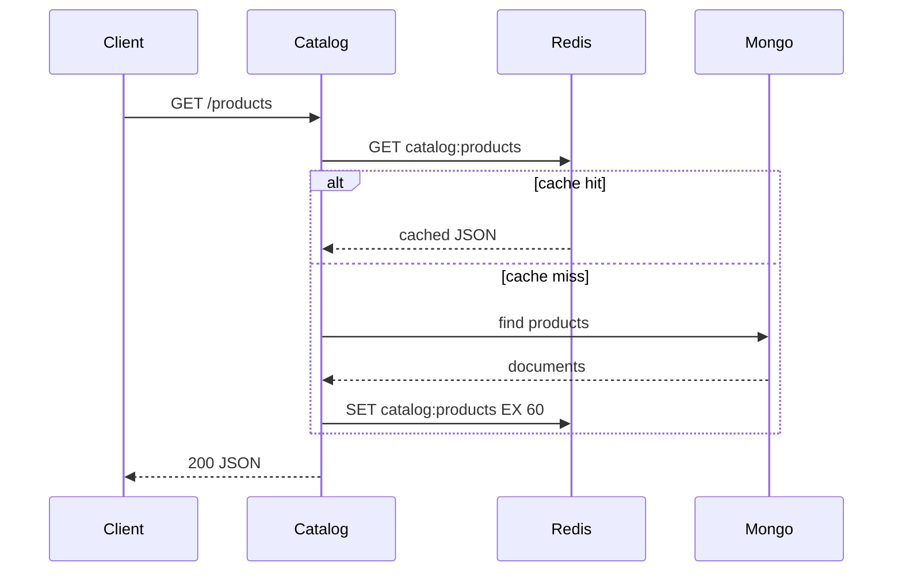

# Caching

StreamShop uses **Redis 8** as an in-memory cache. Redis is never used as a primary datastore — this keeps the durable vs ephemeral storage story clear.

## What's running today

Redis is in Docker Compose (`localhost:6379`, no password). catalog-api uses **cache-aside** on product list and detail: Redis first, Mongo on miss, then `SET` with TTL **60 seconds**. Redis down does not fail the request — Mongo still serves (`x-cache: miss`). `/ready` pings Mongo only.

Redis Insight is a local debug GUI on [http://localhost:5540](http://localhost:5540) (not behind Traefik). It is preconnected to the Compose Redis service as `streamshop`.

```bash
curl -sI http://localhost:8080/api/catalog/products | grep -i x-cache
docker compose exec redis redis-cli GET catalog:products
```

## Patterns

### Cache-aside (catalog-api)

Product list and detail endpoints use cache-aside:

1. Read from Redis
2. On miss, read from MongoDB
3. Write result to Redis with TTL (60 seconds)



### Idempotency keys (order-api)

Order creation accepts an `Idempotency-Key` header. The Go service stores the key in Redis:

```
SET idempotency:{key} {order_id} NX EX 3600
```

Duplicate requests within the TTL window return the original order without re-processing.

### Rate limit backing (optional)

Traefik rate limiting can be backed by Redis for distributed counting across gateway instances.

## Key naming convention

| Key pattern | TTL | Purpose |
|-------------|-----|---------|
| `catalog:products` | 60s | Product list |
| `catalog:product:{id}` | 60s | Single product |
| `idempotency:{key}` | 3600s | Order deduplication |

## Observability

Cache hit/miss counters are **planned** (`catalog_cache_hits_total`, `catalog_cache_misses_total`). Today the `x-cache` response header is `hit` or `miss` on catalog product routes.
