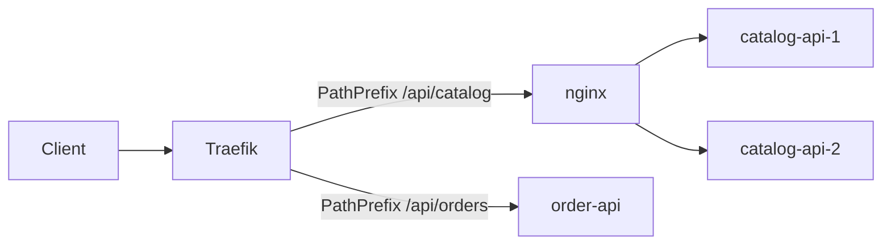

# Load Balancing

StreamShop demonstrates **two layers** of load balancing that employers will recognize in production systems.

## What's running today



- **Traefik** on `:8080` is the edge gateway
- **nginx** load-balances `/api/catalog` to two catalog-api replicas (`round_robin`)
- Replicas are also on **:3001** (`catalog-api-1`) and **:3011** (`catalog-api-2`) for health/debug
- Redis is shared — cache-aside still works across replicas

OSS nginx has **passive** upstream checks (`max_fails` / `fail_timeout` / `proxy_next_upstream`). Each replica still has a Compose healthcheck on `/health`. Active `/health` probes would need nginx Plus.

## Layer 1: Traefik (edge gateway)

Traefik routes incoming requests to the correct service based on path prefix. It handles TLS termination, global middleware, and the external-facing entrypoint at `localhost:8080`. Catalog traffic is forwarded to **nginx**, not to a replica directly.

## Layer 2: nginx (internal)

An **nginx** instance load-balances across **two replicas** of `catalog-api`. The catalog is read-heavy and cache-friendly, a natural candidate for horizontal scaling.

Config lives in `infra/nginx/catalog-upstream.conf` and `infra/nginx/nginx.conf`.

```nginx
upstream catalog {
    server catalog-api-1:3001 max_fails=3 fail_timeout=30s;
    server catalog-api-2:3001 max_fails=3 fail_timeout=30s;
}
```

`round_robin` is the nginx default (no `least_conn`). Sequential curls then alternate replicas, which is the demo you want. `least_conn` is a better production default under concurrent load.

## Why only catalog is replicated

| Service | Replicas | Rationale |
|---------|----------|-----------|
| `catalog-api` | 2 | Read-heavy, stateless, cache-backed |
| `order-api` | 1 | Write path; idempotency handles retries |
| `analytics-api` | 1 | Query service; scale via read replicas later |
| `event-processor` | 1 | Kafka consumer group handles parallelism |

Replicating everything locally would consume unnecessary RAM. The docs explain when and how you'd scale each service in production.

## Demo: verify load balancing

```bash
for i in $(seq 1 8); do
  curl -sI http://localhost:8080/api/catalog/products | grep -i x-replica-id
done
```

You should see `catalog-api-1` and `catalog-api-2`. nginx also sets `x-upstream` to the chosen backend address.

Hit a replica directly:

```bash
curl http://localhost:3001/health   # catalog-api-1
curl http://localhost:3011/health   # catalog-api-2
```

See the [add catalog replica runbook](../runbooks/add-catalog-replica) for scaling instructions.
