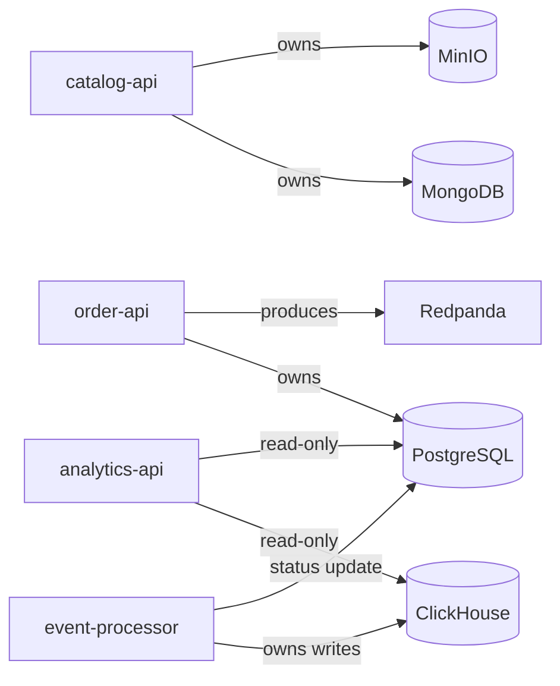

# Microservices

StreamShop is polyglot by design — each language handles a role that fits its strengths, not four identical CRUD apps.

## Service map (target)

| Service | Language | Framework | Port | Replicas | Status |
|---------|----------|-----------|------|----------|--------|
| `catalog-api` | Node.js 22 + TypeScript | Fastify | 3001 / 3011 | 2 | **Built** (nginx + Redis cache) |
| `order-api` | Go 1.26 | stdlib `net/http` | 3002 | 1 | **Built** |
| `analytics-api` | Python 3.12 | FastAPI | 3003 | 1 | Planned |
| `event-processor` | Rust | Axum + rdkafka | 3004 | 1 | **Built** |

## catalog-api (Node.js + TypeScript)

**Status:** **Implemented** (2 replicas behind nginx; health + Mongo product list/detail + Redis cache-aside + MinIO image URLs).

**Responsibility:** Product reads, Redis cache-aside, MinIO image URLs; image upload planned.

- Endpoints: `GET /health`, `GET /ready`, `GET /api/catalog/products`, `GET /api/catalog/products/:id`
- Writes/reads: MongoDB (`products`); Redis cache (list + detail); MinIO (`product-images` reads)
- Planned: MinIO image upload
- Why Node.js: Fast I/O for HTTP-heavy read workloads; rich AWS SDK for MinIO

Full reference: [catalog-api service doc](../services/catalog-api).

## order-api (Go)

**Status:** **Implemented** (sync write + `order.created` produce).

**Responsibility:** Order creation, Postgres transactions, Redpanda produce.

- Writes: PostgreSQL (`orders`, `order_items`); Redpanda (`orders.events`)
- Endpoints: `GET /health`, `GET /ready`, `POST /api/orders`
- Planned: Redis idempotency

Full reference: [order-api service doc](../services/order-api).

- Why Go: Strong concurrency model, excellent Postgres client ecosystem

## analytics-api (Python) — planned

**Responsibility:** OLAP queries, reporting endpoints, Postgres detail reads.

- Reads: ClickHouse (aggregates), PostgreSQL (order detail)
- Why Python: FastAPI + clickhouse-driver for rapid analytics API development

## event-processor (Rust)

**Status:** **Implemented** (consume `order.created` → ClickHouse + Postgres status).

**Responsibility:** Consume `orders.events`, validate payload, write ClickHouse, update order status.

- Writes: ClickHouse (`order_events`); PostgreSQL (`orders.status`)
- Endpoints: `GET /health`, `GET /ready`
- Planned: analytics-api reads ClickHouse
- Why Rust: Memory-safe, high-throughput consumer; ideal for always-on background processing

Full reference: [event-processor service doc](../services/event-processor).

## Cross-cutting concerns

**Target** for every service:

| Concern | Standard | order-api | catalog-api | event-processor |
|---------|----------|-----------|-------------|-----------------|
| Health | `GET /health` | Yes | Yes | Yes |
| Readiness | `GET /ready` | Yes | Yes | Yes |
| Tracing | OpenTelemetry → Jaeger | No | No | No |
| Metrics | Prometheus `/metrics` | No | No | No |
| Logging | Structured JSON | Yes (slog) | Yes (pino via Fastify) | Yes (tracing) |
| Config | Env via Compose | Yes | Yes | Yes |
| API spec | OpenAPI in `services/{name}/` | No | No | No |

## Service boundaries

No service writes to another service's primary datastore directly — all cross-service communication goes through HTTP or the message queue. event-processor is the documented exception: it updates `orders.status` after consuming `order.created`.
