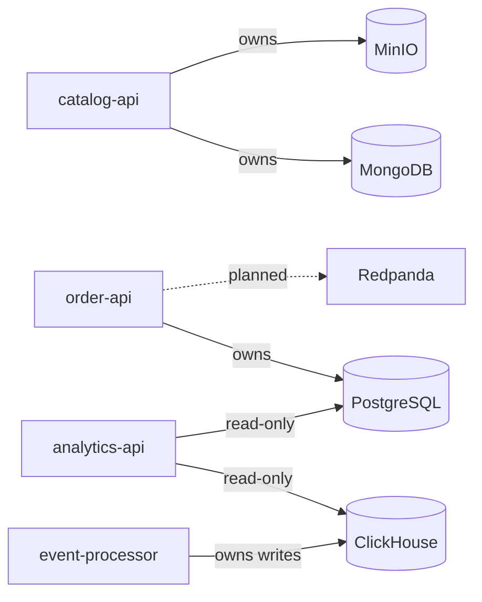

# Microservices

StreamShop is polyglot by design — each language handles a role that fits its strengths, not four identical CRUD apps.

## Service map (target)

| Service | Language | Framework | Port | Replicas | Status |
|---------|----------|-----------|------|----------|--------|
| `catalog-api` | Node.js 22 + TypeScript | Fastify | 3001 | 2 | **Built** (health only) |
| `order-api` | Go 1.26 | stdlib `net/http` | 3002 | 1 | **Built** |
| `analytics-api` | Python 3.12 | FastAPI | 3003 | 1 | Planned |
| `event-processor` | Rust | Axum + rdkafka | 3004 | 1 | Planned |

## catalog-api (Node.js + TypeScript)

**Status:** **Implemented** (health only).

**Responsibility:** Product CRUD, image upload URLs, Redis cache-aside *(planned)*.

- Endpoints: `GET /health`
- Planned: MongoDB (products), MinIO (images), Redis cache-aside
- Why Node.js: Fast I/O for HTTP-heavy read workloads; rich AWS SDK for MinIO

Full reference: [catalog-api service doc](../services/catalog-api).

## order-api (Go)

**Status:** **Implemented** (sync write path only).

**Responsibility:** Order creation and Postgres transactions.

- Writes: PostgreSQL (`orders`, `order_items`)
- Endpoints: `GET /health`, `POST /api/orders`
- Planned: Redpanda `order.created` events, Redis idempotency

Full reference: [order-api service doc](../services/order-api).

- Why Go: Strong concurrency model, excellent Postgres client ecosystem

## analytics-api (Python) — planned

**Responsibility:** OLAP queries, reporting endpoints, Postgres detail reads.

- Reads: ClickHouse (aggregates), PostgreSQL (order detail)
- Why Python: FastAPI + clickhouse-driver for rapid analytics API development

## event-processor (Rust) — planned

**Responsibility:** Consume `orders.events`, validate schema, enrich, write ClickHouse + update Postgres status.

- Writes: ClickHouse (analytics facts), PostgreSQL (order status)
- Why Rust: Memory-safe, high-throughput consumer; ideal for always-on background processing

## Cross-cutting concerns

**Target** for every service:

| Concern | Standard | order-api today | catalog-api today |
|---------|----------|-----------------|-------------------|
| Health | `GET /health` | Yes | Yes |
| Readiness | `GET /ready` | No | No |
| Tracing | OpenTelemetry → Jaeger | No | No |
| Metrics | Prometheus `/metrics` | No | No |
| Logging | Structured JSON | Yes (slog) | Yes (pino via Fastify) |
| Config | Env via Compose | Yes | Yes |
| API spec | OpenAPI in `services/{name}/` | No | No |

## Service boundaries

No service writes to another service's primary datastore directly — all cross-service communication goes through HTTP or the message queue.
