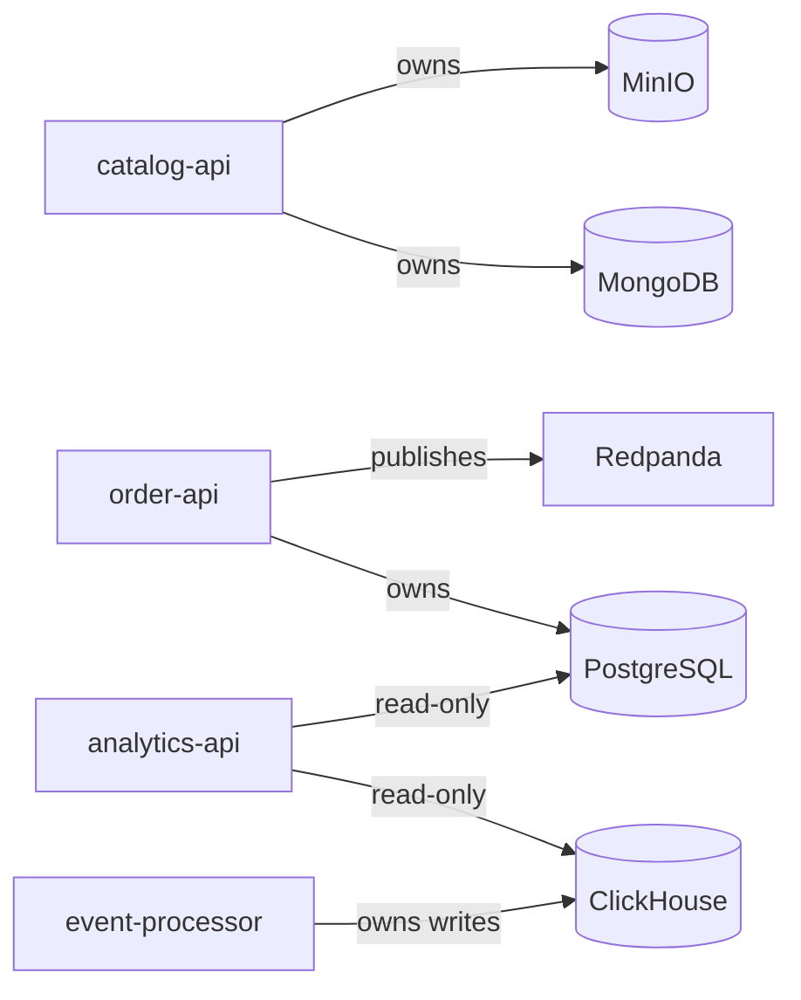

# Microservices

StreamShop is polyglot by design — each language handles a role that fits its strengths, not four identical CRUD apps.

## Service map

| Service | Language | Framework | Port | Replicas |
|---------|----------|-----------|------|----------|
| `catalog-api` | Node.js 22 | Fastify | 3001 | 2 |
| `order-api` | Go 1.22+ | Echo | 3002 | 1 |
| `analytics-api` | Python 3.12 | FastAPI | 3003 | 1 |
| `event-processor` | Rust | Axum + rdkafka | 3004 | 1 |

## catalog-api (Node.js)

**Responsibility:** Product CRUD, image upload URLs, Redis cache-aside.

- Writes: MongoDB (products), MinIO (images)
- Reads: Redis → MongoDB fallback
- Why Node.js: Fast I/O for HTTP-heavy read workloads; rich AWS SDK for MinIO

## order-api (Go)

**Responsibility:** Order creation, Postgres transactions, Redpanda event publishing.

- Writes: PostgreSQL (orders, order_items)
- Publishes: `order.created` events to Redpanda
- Why Go: Strong concurrency model, excellent Postgres and Kafka client ecosystems

## analytics-api (Python)

**Responsibility:** OLAP queries, reporting endpoints, Postgres detail reads.

- Reads: ClickHouse (aggregates), PostgreSQL (order detail)
- Why Python: FastAPI + clickhouse-driver for rapid analytics API development

## event-processor (Rust)

**Responsibility:** Consume `orders.events`, validate schema, enrich, write ClickHouse + update Postgres status.

- Writes: ClickHouse (analytics facts), PostgreSQL (order status)
- Why Rust: Memory-safe, high-throughput consumer; ideal for always-on background processing

## Cross-cutting concerns

Every service implements:

| Concern | Standard |
|---------|----------|
| Health | `GET /health` (liveness), `GET /ready` (readiness) |
| Tracing | OpenTelemetry → Jaeger via OTLP |
| Metrics | Prometheus `/metrics` scrape endpoint |
| Logging | Structured JSON with `trace_id` field |
| Config | Environment variables via Compose (no secrets in repo) |
| API spec | OpenAPI 3.1 in `services/{name}/openapi.yaml` |

## Service boundaries

No service writes to another service's primary datastore directly — all cross-service communication goes through HTTP or the message queue.
