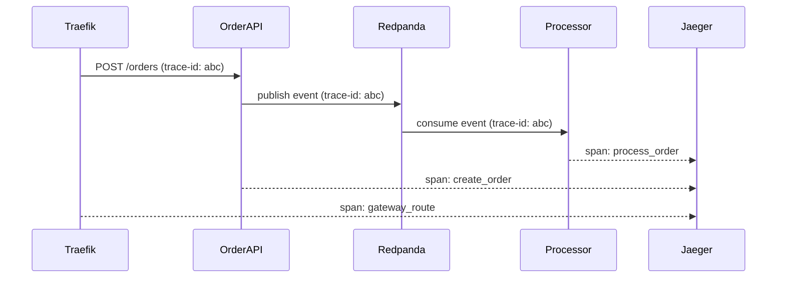

# Observability

Observability is a key differentiator for this portfolio project. StreamShop implements the three pillars across all services:

1. traces
2. metrics
3. logs

## Stack

| Tool | Role |
|------|------|
| OpenTelemetry SDK | Instrumentation in every service |
| OTel Collector | Receives OTLP, exports to backends |
| Jaeger | Distributed trace storage and UI |
| Prometheus | Metrics scraping and storage |
| Grafana | Dashboards |

All observability services run under the `observability` Compose profile. The containers are defined in `docker-compose.yml`; config lives under `infra/`.

| Container | Image | Config |
|-----------|-------|--------|
| `otel-collector` | `otel/opentelemetry-collector-contrib:0.115.0` | `infra/otel-collector/config.yaml` |
| `jaeger` | `jaegertracing/jaeger:2.6` | env: `COLLECTOR_OTLP_ENABLED=true` |
| `prometheus` | `prom/prometheus:v3.4.1` | `infra/prometheus/prometheus.yaml` |
| `grafana` | `grafana/grafana:11.6.0` | `infra/grafana/provisioning/` + `infra/grafana/dashboards/` |

## Distributed tracing

Every HTTP request and Kafka message gets a trace span. Context is propagated via W3C `traceparent` headers.



View traces at `http://localhost:16686` (Jaeger UI).

## Metrics

Each service exposes a `/metrics` endpoint in Prometheus format.

### Key metrics

| Metric | Service | Description |
|--------|---------|-------------|
| `http_request_duration_seconds` | All | Request latency histogram |
| `catalog_cache_hits_total` | catalog-api | Redis cache hit count |
| `orders_created_total` | order-api | Orders created counter |
| `kafka_consumer_lag` | event-processor | Messages behind latest offset |
| `clickhouse_rows_inserted_total` | event-processor | OLAP rows written |

## Grafana dashboards

Pre-built dashboards cover:

- Request rate and p95 latency per service
- Kafka consumer lag
- Cache hit ratio
- ClickHouse insert throughput

Access Grafana at `http://localhost:3000` (admin/admin in local dev).

## Structured logging

All services emit JSON logs to stdout:

```json
{
  "level": "info",
  "msg": "order created",
  "order_id": "550e8400-e29b-41d4-a716-446655440000",
  "trace_id": "abc123",
  "service": "order-api"
}
```

Docker Compose aggregates logs via `docker compose logs -f {service}`.

## Per-service SDK integration

All four services have OpenTelemetry SDKs wired in. They export via OTLP gRPC to the OTel Collector (`OTEL_EXPORTER_OTLP_ENDPOINT`). When the collector is not running (default `docker compose up` without the profile), the SDKs fail gracefully and the services run without telemetry.

| Service | SDK | Instrumentation |
|---------|-----|-----------------|
| `order-api` (Go) | `go.opentelemetry.io/otel` | Custom HTTP middleware (traces + metrics) |
| `catalog-api` (Node) | `@opentelemetry/sdk-node` | Auto-instrumentation (Fastify, MongoDB, Redis, HTTP) via `--import ./src/instrumentation.ts` |
| `analytics-api` (Python) | `opentelemetry-sdk` | `FastAPIInstrumentor` + OTLP exporter |
| `event-processor` (Rust) | `tracing-opentelemetry` | Bridges existing `tracing` spans to OTel |

## Compose profile

```bash
docker compose --profile observability up -d
```

This starts: `otel-collector`, `jaeger`, `prometheus`, `grafana`.
