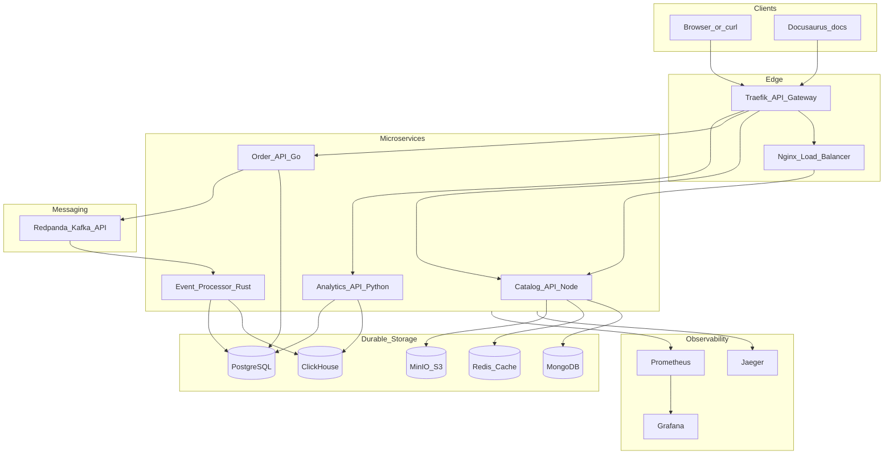

# Architecture Overview

StreamShop is an event-driven commerce and analytics platform. Requests enter through an API gateway, fan out to polyglot microservices, and async events flow through a Kafka-compatible queue into an OLAP store.

## High-level diagram

## Orchestration

Everything runs locally via **Docker Compose** with optional profiles:

- **`minimal`** — gateway, core services, Postgres, Redis
- **`full`** — all databases, Redpanda, MinIO, observability stack

Two Docker networks isolate concerns:

- `streamshop` — service-to-service traffic
- `data` — internal network for databases (not exposed on host in demo mode)

## Service responsibilities

| Service | Owns writes to | Reads from |
|---------|----------------|------------|
| `catalog-api` | MongoDB, MinIO | Redis (cache) |
| `order-api` | PostgreSQL | — |
| `event-processor` | ClickHouse, PostgreSQL (status) | Redpanda |
| `analytics-api` | — (read-only) | ClickHouse, PostgreSQL |

Each service exposes `/health` and `/ready` endpoints and emits OpenTelemetry traces.

## Component index

| Component | Technology | Doc |
|-----------|------------|-----|
| API Gateway | Traefik v3 | [API Gateway](./api-gateway) |
| Load Balancer | nginx | [Load Balancing](./load-balancing) |
| Cache | Redis 7 | [Caching](./caching) |
| Message Queue | Redpanda | [Messaging](./messaging) |
| SQL (OLTP) | PostgreSQL 16 | [Storage](./storage) |
| NoSQL | MongoDB 7 | [Storage](./storage) |
| OLAP | ClickHouse 24 | [Storage](./storage) |
| Object storage | MinIO | [Storage](./storage) |
| Observability | OTel, Jaeger, Prometheus, Grafana | [Observability](./observability) |

## User journeys

1. **Browse catalog** — cached product list served by Node.js behind nginx (2 replicas)
2. **Upload product image** — multipart upload to MinIO via catalog-api
3. **Place order** — Go service writes to Postgres, publishes `order.created` to Redpanda
4. **Async processing** — Rust consumer enriches event, writes ClickHouse, updates order status
5. **Analytics** — Python service queries ClickHouse aggregates and Postgres detail

See [Order Placement](../data-flows/order-placement) for a sequence diagram.
