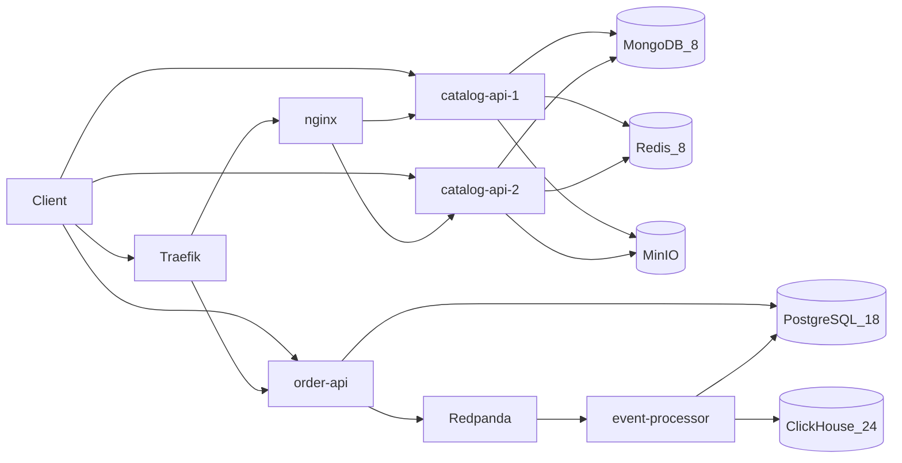
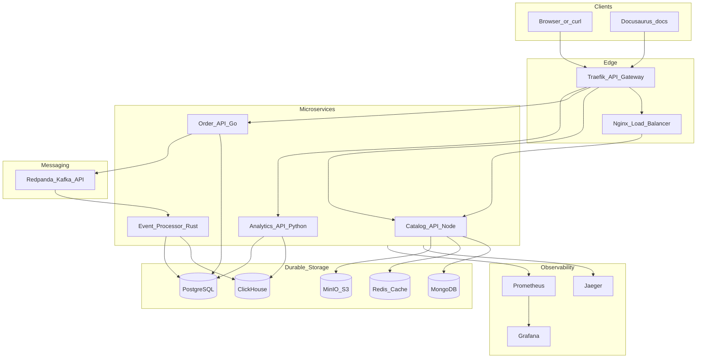

# Architecture Overview

StreamShop is an event-driven commerce and analytics platform. The **target** architecture routes requests through an API gateway to polyglot microservices; async events flow through a Kafka-compatible queue into an OLAP store.

## What's running today

- **Traefik** on `:8080` — `/api/orders` → order-api, `/api/catalog` → nginx → catalog replicas, `/api/analytics` → analytics-api, `/docs/` → docs-site; dashboard on `:8081`
- **nginx** — round_robin across `catalog-api-1` and `catalog-api-2`
- **catalog-api** — replica 1 on `:3001`, replica 2 on `:3011` (`GET /health`, `GET /ready`, product list/detail)
- **order-api** on `:3002` — `GET /health`, `GET /ready`, `POST /api/orders` (Postgres write then `order.created`)
- **PostgreSQL** — `orders` and `order_items` tables
- **MongoDB** — `products` collection
- **Redis** — cache-aside for catalog list/detail (TTL 60s; fail-open)
- **Redis Insight** on `:5540` — local GUI; not behind Traefik
- **MinIO** — S3 API `:9000`, console `:9001`; buckets `product-images` and `exports`; catalog-api returns presigned `image_url` on product reads (upload via API is planned)
- **Redpanda** v26.2.1 — Kafka API `:19092` (host), `redpanda:9092` (Compose); `orders.events` from order-api
- **Redpanda Console** on `:8082` — local GUI for topics and messages; not behind Traefik
- **event-processor** on `:3004` — consumes `order.created`, writes ClickHouse, marks orders `processed`
- **ClickHouse** HTTP `:8123` — `order_events` (native port not published; MinIO uses `:9000`)

Details: [catalog-api](../services/catalog-api), [order-api](../services/order-api), [event-processor](../services/event-processor), [Quick Start](../getting-started/quick-start).

## Target architecture

## Orchestration (target)

Docker Compose with optional profiles:

- **`minimal`** — gateway, core services, Postgres, Redis *(not yet defined)*
- **`full`** — all databases, Redpanda, MinIO, observability *(not yet defined)*

Today: `make up` (Compose without extra profiles) runs Traefik, nginx, postgres, mongo, redis, redisinsight, minio, redpanda, redpanda-console, clickhouse, event-processor, analytics-api, order-api, catalog-api-1, catalog-api-2, and docs-site. Then `make seed` and `make smoke`.

## Service responsibilities (target)

| Service | Owns writes to | Reads from |
|---------|----------------|------------|
| `catalog-api` | MongoDB, MinIO | Redis (cache) |
| `order-api` | PostgreSQL, Redpanda | — |
| `event-processor` | ClickHouse, PostgreSQL (status) | Redpanda |
| `analytics-api` | — (read-only) | ClickHouse, PostgreSQL |

**catalog-api today:** two replicas behind nginx; `GET /health`, `GET /ready` (Mongo ping), `GET /api/catalog/products`, and `GET /api/catalog/products/:id` with Redis cache-aside and MinIO presigned `image_url`; upload via the API is not wired yet.

**order-api today:** writes to PostgreSQL then publishes `order.created` to `orders.events` (fail-open); exposes `GET /health`, `GET /ready` (Postgres ping), and `POST /api/orders` (no tracing or metrics yet).

**event-processor today:** consumes `orders.events`, inserts ClickHouse `order_events`, sets Postgres `orders.status = processed`, then commits the offset. Invalid payloads go to `orders.events.dlq`.

## Component index

| Component | Technology | Doc | Status |
|-----------|------------|-----|--------|
| API Gateway | Traefik v3 | [API Gateway](./api-gateway) | **Built** (`/api/orders`, `/api/catalog`) |
| Load Balancer | nginx | [Load Balancing](./load-balancing) | **Built** (2× catalog-api) |
| Cache | Redis 8 | [Caching](./caching) | **Built** (cache-aside, 60s TTL) |
| Message Queue | Redpanda | [Messaging](./messaging) | **Built** (produce + consume) |
| SQL (OLTP) | PostgreSQL 18 | [Storage](./storage) | **Built** |
| NoSQL | MongoDB 8 | [Storage](./storage) | **Built** |
| OLAP | ClickHouse 24 | [Storage](./storage) | **Built** (`order_events` writes) |
| Object storage | MinIO | [Storage](./storage) | **Built** (presigned GET on catalog reads) |
| Observability | OTel, Jaeger, Prometheus, Grafana | [Observability](./observability) | Planned |

## User journeys (target)

1. **Browse catalog** — cached product list behind nginx (2 replicas)
2. **Upload product image** — MinIO via catalog-api
3. **Place order** — Go service writes to Postgres, publishes `order.created`
4. **Async processing** — Rust consumer → ClickHouse + `processed`; analytics-api reads aggregates and order detail *(built)*
5. **Analytics** — Python queries ClickHouse + Postgres

See [Order Placement](../data-flows/order-placement) for the full flow and what's implemented.
