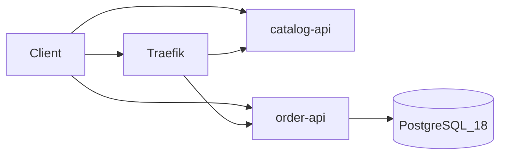
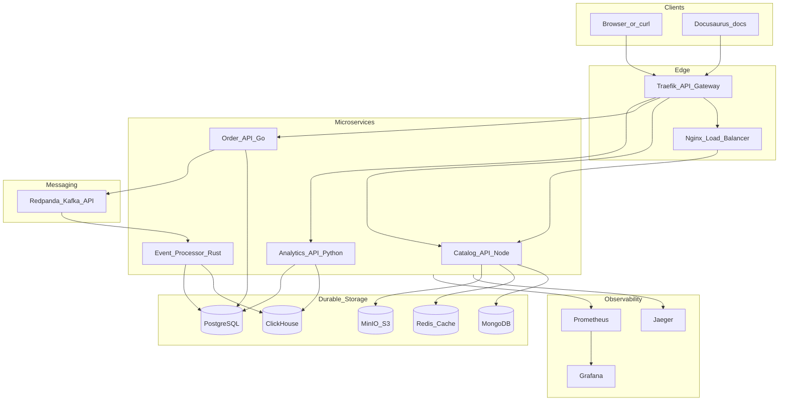

# Architecture Overview

StreamShop is an event-driven commerce and analytics platform. The **target** architecture routes requests through an API gateway to polyglot microservices; async events flow through a Kafka-compatible queue into an OLAP store.

## What's running today

- **Traefik** on `:8080` — `/api/orders` → order-api, `/api/catalog` → catalog-api; dashboard on `:8081`
- **catalog-api** on `:3001` — `GET /health`, `GET /api/catalog/products` (in-memory; also reachable directly)
- **order-api** on `:3002` — `GET /health`, `POST /api/orders` (also reachable directly)
- **PostgreSQL** — `orders` and `order_items` tables
- No Mongo, queue, or other services yet

Details: [catalog-api](../services/catalog-api), [order-api](../services/order-api), [Quick Start](../getting-started/quick-start).

## Target architecture

## Orchestration (target)

Docker Compose with optional profiles:

- **`minimal`** — gateway, core services, Postgres, Redis *(not yet defined)*
- **`full`** — all databases, Redpanda, MinIO, observability *(not yet defined)*

Today: `docker compose up` runs Traefik, postgres, order-api, and catalog-api.

## Service responsibilities (target)

| Service | Owns writes to | Reads from |
|---------|----------------|------------|
| `catalog-api` | MongoDB, MinIO | Redis (cache) |
| `order-api` | PostgreSQL | — |
| `event-processor` | ClickHouse, PostgreSQL (status) | Redpanda |
| `analytics-api` | — (read-only) | ClickHouse, PostgreSQL |

**catalog-api today:** `GET /health` and `GET /api/catalog/products` from an in-memory list; Mongo, Redis, and MinIO are not wired yet.

**order-api today:** writes to PostgreSQL only; exposes `GET /health` (no `/ready`, tracing, or metrics yet).

## Component index

| Component | Technology | Doc | Status |
|-----------|------------|-----|--------|
| API Gateway | Traefik v3 | [API Gateway](./api-gateway) | **Built** (`/api/orders`, `/api/catalog`) |
| Load Balancer | nginx | [Load Balancing](./load-balancing) | Planned |
| Cache | Redis 7 | [Caching](./caching) | Planned |
| Message Queue | Redpanda | [Messaging](./messaging) | Planned |
| SQL (OLTP) | PostgreSQL 18 | [Storage](./storage) | **Built** |
| NoSQL | MongoDB 7 | [Storage](./storage) | Planned |
| OLAP | ClickHouse 24 | [Storage](./storage) | Planned |
| Object storage | MinIO | [Storage](./storage) | Planned |
| Observability | OTel, Jaeger, Prometheus, Grafana | [Observability](./observability) | Planned |

## User journeys (target)

1. **Browse catalog** — cached product list behind nginx (2 replicas)
2. **Upload product image** — MinIO via catalog-api
3. **Place order** — Go service writes to Postgres, publishes `order.created` *(write only today)*
4. **Async processing** — Rust consumer → ClickHouse
5. **Analytics** — Python queries ClickHouse + Postgres

See [Order Placement](../data-flows/order-placement) for the full flow and what's implemented.
