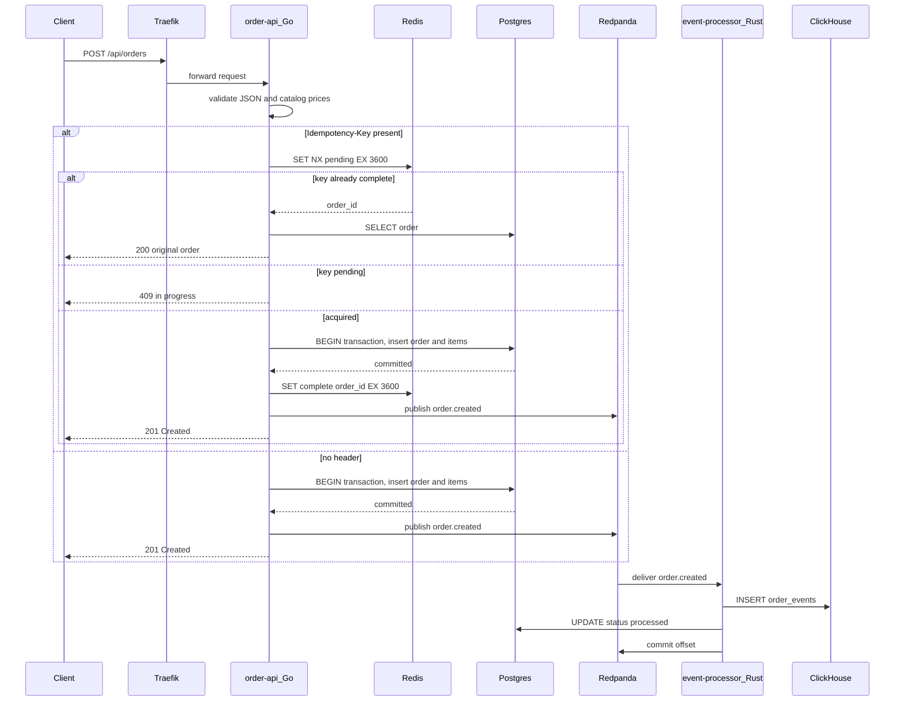
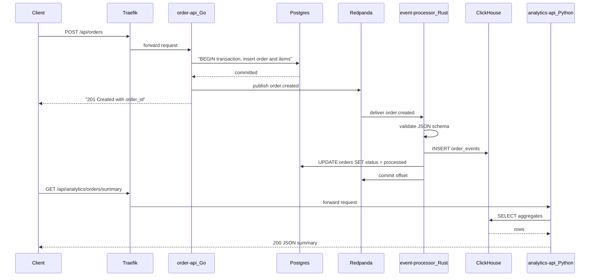

# Order Placement

End-to-end order flow from HTTP request to a ClickHouse analytics row. **The write, publish, consume, and analytics read path are implemented today.**

## Implemented today



### Try it

With the stack up (`make up && make seed`):

```bash
make smoke
```

Or place an order by hand:

```bash
curl -s -X POST http://localhost:8080/api/orders \
  -H 'Content-Type: application/json' \
  -H 'Idempotency-Key: demo-001' \
  -d '{
    "user_id": "660e8400-e29b-41d4-a716-446655440001",
    "items": [
      {"product_id": "prod-001", "qty": 2, "price_pence": 1999}
    ]
  }'
```

What happens:

1. JSON body is validated (`user_id` UUID, non-empty `items`, positive `qty`, `price_pence` &gt;= 0); catalog prices are checked when `CATALOG_API_URL` is set
2. `total_pence` is computed server-side
3. If `Idempotency-Key` is sent, Redis `SET NX` reserves the key (replay → `200`, in-flight → `409`)
4. Order + line items inserted in one Postgres transaction
5. Redis key updated to `complete` with `order_id`
6. `order.created` published to `orders.events` (fail-open if Redpanda is down)
7. `201` response with order JSON (`status: "pending"`)
8. event-processor inserts ClickHouse `order_events` and sets Postgres status to `processed`

The header is optional. Omit it and every POST creates a new order.

Full API details: [order-api](../services/order-api).

---

## Full pipeline (planned)



### Planned steps after order creation

- **Idempotency** — `Idempotency-Key` header + Redis *(built)*
- **Event publish** — `order.created` to Redpanda topic `orders.events` *(built; fail-open)*
- **Async processing** — Rust consumer → ClickHouse + status update *(built)*
- **Analytics** — `GET /api/analytics/orders/summary` via Traefik *(built)*

### Failure behaviour

| Failure | Behaviour |
|---------|------------------|
| Postgres unavailable | `503` from order-api; no event published |
| Redis unavailable + `Idempotency-Key` | `503` `idempotency unavailable`; no order created |
| Redis unavailable, no header | Order created as usual |
| Duplicate `Idempotency-Key` (complete) | `200` with the original order |
| Duplicate `Idempotency-Key` (in progress) | `409` |
| Redpanda unavailable | Order saved; `201`; error logged *(outbox planned)* |
| Processor crash | Offset not committed; redelivery on restart |
| Invalid event schema | Message to `orders.events.dlq` |

See [Inspect Kafka lag](../runbooks/inspect-kafka-lag) if `orders.status` stays `pending`.
