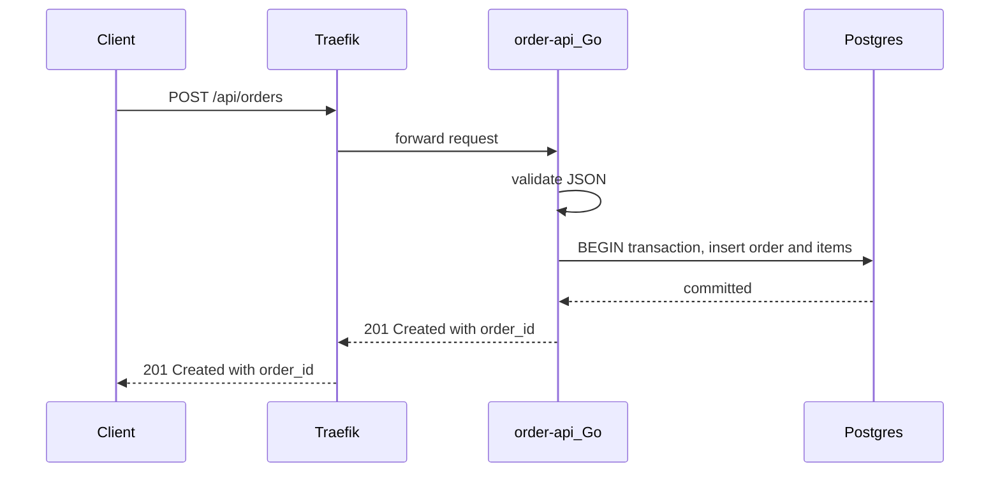
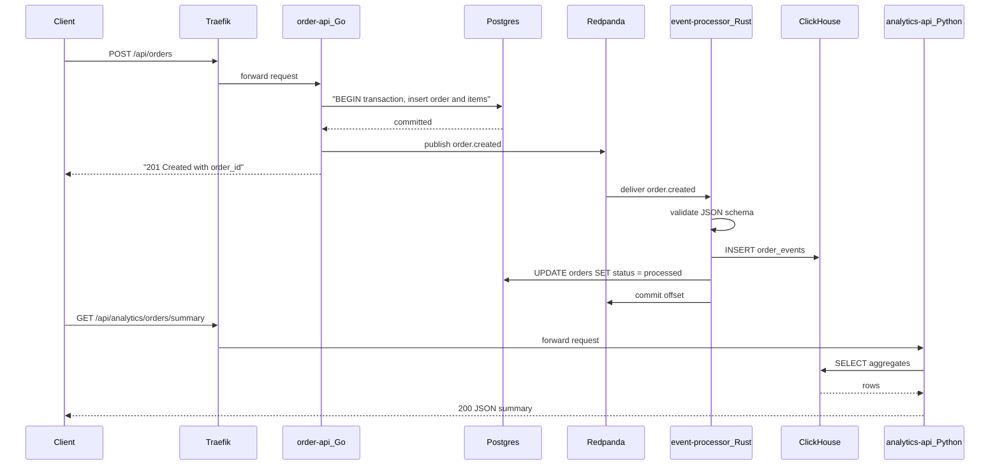

# Order Placement

End-to-end order flow from HTTP request to analytics row. **Traefik routing and the sync Postgres write are implemented today** — the rest is the target design.

## Implemented today



### Try it

```bash
curl -s -X POST http://localhost:8080/api/orders \
  -H 'Content-Type: application/json' \
  -d '{
    "user_id": "660e8400-e29b-41d4-a716-446655440001",
    "items": [
      {"product_id": "prod-001", "qty": 2, "price_pence": 1999}
    ]
  }'
```

What happens:

1. JSON body is validated (`user_id` UUID, non-empty `items`, positive `qty`, `price_pence` &gt;= 0)
2. `total_pence` is computed server-side
3. Order + line items inserted in one Postgres transaction
4. `201` response with order JSON (`status: "pending"`)

Not implemented yet: idempotency keys, event publish, async processor, analytics. Redpanda itself is in Compose.

Full API details: [order-api](../services/order-api).

---

## Full pipeline (planned)



### Planned steps after order creation

- **Idempotency** — `Idempotency-Key` header + Redis *(not built)*
- **Event publish** — `order.created` to Redpanda topic `orders.events` *(broker is in Compose; produce not built)*
- **Async processing** — Rust consumer → ClickHouse + status update *(not built)*
- **Analytics** — `GET /api/analytics/orders/summary` via Traefik *(not built)*

### Planned failure behaviour

| Failure | Target behaviour |
|---------|------------------|
| Postgres unavailable | `503` from order-api; no event published |
| Redpanda unavailable | Order saved; retry / outbox pattern |
| Processor crash | Offset not committed; redelivery on restart |
| Invalid event schema | Message to `orders.events.dlq` |
| Duplicate idempotency key | Return original order |

See [Runbooks](../runbooks/inspect-kafka-lag) when the event pipeline exists.
