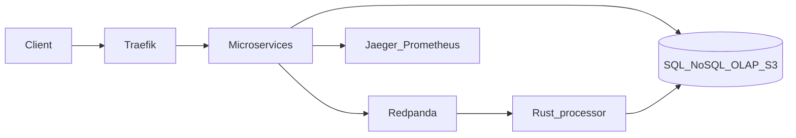

# Introduction

**StreamShop** is a fictional UK commerce platform built to demonstrate real-world distributed systems patterns — runnable locally on a developer laptop with Docker Compose.

Customers browse a product catalog, place orders, and trigger an event pipeline that feeds real-time analytics. The repo is built in phases: each slice is runnable and documented before the next layer is added.

## Implementation status

| Area | Status |
|------|--------|
| [order-api](./services/order-api) — health + ready + create order + `order.created` | **Built** |
| [catalog-api](./services/catalog-api) — health + product list/detail | **Built** |
| PostgreSQL — orders schema | **Built** |
| MongoDB — product catalog | **Built** |
| Traefik — `/api/orders`, `/api/catalog` on `:8080` | **Built** |
| nginx | **Built** (2× catalog-api, round_robin) |
| Redis | **Built** (cache-aside, 60s TTL) |
| MinIO | **Built** (presigned `image_url` on catalog GET; upload planned) |
| [event-processor](./services/event-processor) — consume `order.created` | **Built** |
| Redpanda | **Built** (broker, Console `:8082`, produce + consume) |
| ClickHouse | **Built** (`order_events`) |
| analytics-api | Planned |
| Observability stack | Planned |

See [Quick Start](./getting-started/quick-start) to run what exists today.

## What you'll find here

- **Service docs** — [catalog-api](./services/catalog-api), [order-api](./services/order-api), [event-processor](./services/event-processor)
- **Architecture** — target design for gateway, messaging, storage, observability
- **Data flows** — end-to-end journeys (with built vs planned sections)
- **ADRs** — design rationale
- **Runbooks** — ops tasks for when the full stack exists

## Primary audience

Hiring managers and senior engineers reviewing a portfolio project. The repo prioritises a coherent domain story, clear service boundaries, and honest documentation of what's implemented vs planned.

## Non-goals

- Cloud deployment or multi-region HA
- Petabyte-scale throughput
- Production-grade security hardening

## Target architecture

## Microservices (target)

| Service | Language | Responsibility |
|---------|----------|----------------|
| `catalog-api` | Node.js + TypeScript | Product catalog, caching, image uploads |
| `order-api` | Go | Order creation, Postgres transactions, `order.created` |
| `analytics-api` | Python | OLAP queries and reporting |
| `event-processor` | Rust | Async event consumption and enrichment |

See [Architecture Overview](./architecture/overview) for the full target diagram.
