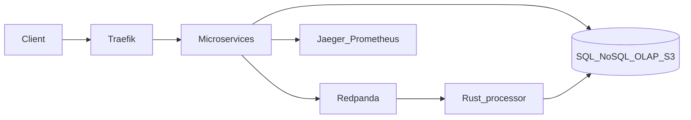

# Introduction

**StreamShop** is a fictional commerce platform built to demonstrate real-world distributed systems patterns — all runnable locally on a developer laptop with a single `docker compose up`.

Customers browse a product catalog, place orders, and trigger an event pipeline that feeds real-time analytics. The system is intentionally polyglot and multi-store: each service owns a clear boundary, and infrastructure components (gateway, load balancer, cache, message queue, observability) are first-class citizens of the demo.

## What you'll find here

- **Architecture docs** — how Traefik, nginx, Redis, Redpanda, PostgreSQL, MongoDB, ClickHouse, and MinIO fit together
- **Data flow walkthroughs** — end-to-end traces from HTTP request to OLAP row
- **ADRs** — why Docker Compose over k8s, Redpanda over Kafka, and more
- **Runbooks** — operational tasks for local demos and interviews

## Primary audience

This repo is designed for hiring managers and senior engineers reviewing a portfolio project. It prioritizes:

- A coherent domain story (not four identical CRUD apps in different languages)
- One-command local bootstrap
- Cross-service tracing and metrics
- Clear service boundaries and datastore ownership

## Non-goals

- Cloud deployment or multi-region HA
- Petabyte-scale throughput
- Production-grade security hardening

Everything runs locally with modest resource use. See [Quick Start](./getting-started/quick-start) to get going.

## System at a glance

## Microservices

| Service | Language | Responsibility |
|---------|----------|----------------|
| `catalog-api` | Node.js | Product catalog, caching, image uploads |
| `order-api` | Go | Order creation, Postgres transactions, event publishing |
| `analytics-api` | Python | OLAP queries and reporting |
| `event-processor` | Rust | Async event consumption and enrichment |

See [Architecture Overview](./architecture/overview) for the full diagram.
